#  **Kauan Kelvin**

<div align="center">
  
</div>

<div align="center">
  


---

##  **SOBRE MIM**

<div align="center">

```typescript
interface Desenvolvedor {
  nome: string;
  cargo: string;
  localização: string;
  universidade: string;
  paixões: string[];
  foco: string;
  motto: string;
}

const kauan: Desenvolvedor = {
  nome: "Kauan Kelvin",
  cargo: "Desenvolvedor Web & Estudante de Engenharia de Software",
  localização: "Brasília, Brasil 🇧🇷",
  universidade: "UniCesumar",
  paixões: [
    "Desenvolvimento web responsivo",
    "Programação Java elegante", 
    "Arquitetura de banco de dados",
    "Aprendizado contínuo"
  ],
  foco: "Transformando ideias em soluções digitais incríveis ✨",
  motto: "Código limpo, resultados extraordinários! 🚀"
};

console.log(`${kauan.nome} está construindo o futuro, uma linha de cada vez!`);
```

</div>

<div align="center">
  
</div>

---

##  **ARSENAL TECNOLÓGICO**

<div align="center">

###  **LINGUAGENS DE PROGRAMAÇÃO**

<p align="center">
  
</p>


---

###  **FRONTEND & DESIGN**

<p align="center">
  
</p>


---

###  **BANCO DE DADOS & NUVEM**

<p align="center">
  
</p>


---

###  **FERRAMENTAS DE DESENVOLVIMENTO**

<p align="center">
  
</p>


</div>

<div align="center">
  
</div>

---

##  **ESTATÍSTICAS GITHUB**

<div align="center">

<table>
<tr>
<td width="50%">


</td>
<td width="50%">


</td>
</tr>
</table>


</div>

---

##  **PROJETOS EM DESTAQUE**

<div align="center">

<table>
<tr>
<td width="50%" valign="top">

###  **SISTEMA DE XADREZ**

[](https://github.com/kauankelvin7/Jogo-de-Xadrez)

**🎯 SOBRE O PROJETO**  
Sistema completo de xadrez desenvolvido em Java com interface gráfica moderna e lógica de jogo robusta. Implementa todas as regras do xadrez clássico.

**🚀 FUNCIONALIDADES**
- ✅ Interface gráfica intuitiva e elegante
- ✅ Validação inteligente de movimentos
- ✅ Sistema de turnos alternados
- ✅ Detecção automática de xeque-mate
- ✅ Histórico de jogadas

**🛠️ TECNOLOGIAS**  


</td>
<td width="50%" valign="top">

###  **CONTROLE FINANCEIRO**

[](https://github.com/kauankelvin7/ControleDeGastos)

**🎯 SOBRE O PROJETO**  
Aplicação web responsiva para gerenciamento financeiro pessoal com interface moderna e funcionalidades avançadas de análise de gastos.

**🚀 FUNCIONALIDADES**
- ✅ Controle completo de receitas e despesas
- ✅ Categorização automática de transações
- ✅ Relatórios visuais interativos
- ✅ Interface 100% responsiva
- ✅ Dashboard com métricas em tempo real

**🛠️ TECNOLOGIAS**  


</td>
</tr>
</table>

</div>

<div align="center">
  
</div>

---

##  **FORMAÇÃO & CRESCIMENTO**

<div align="center">

### 🎓 **ENGENHARIA DE SOFTWARE**
**UniCesumar** - *Em andamento*

```mermaid
graph LR
    A["🎓 FUNDAMENTOS<br/>DE SOFTWARE"] --> B["💻 DESENVOLVIMENTO<br/>WEB"]
    B --> C["☕ PROGRAMAÇÃO<br/>JAVA"]
    C --> D["🗄️ BANCO DE<br/>DADOS"]
    D --> E["🏗️ ARQUITETURA<br/>DE SISTEMAS"]
    E --> F["🚀 PROJETOS<br/>REAIS"]
    
    style A fill:#00D9FF,stroke:#FFFFFF,stroke-width:2px,color:#000000
    style B fill:#00FF88,stroke:#FFFFFF,stroke-width:2px,color:#000000
    style C fill:#FF6B6B,stroke:#FFFFFF,stroke-width:2px,color:#000000
    style D fill:#4ECDC4,stroke:#FFFFFF,stroke-width:2px,color:#000000
    style E fill:#45B7D1,stroke:#FFFFFF,stroke-width:2px,color:#000000
    style F fill:#96CEB4,stroke:#FFFFFF,stroke-width:2px,color:#000000
```



### 📚 **PRINCIPAIS COMPETÊNCIAS**
- **Desenvolvimento Web** - HTML5, CSS3, JavaScript para aplicações responsivas
- **Programação Java** - POO, aplicações desktop e lógica de programação
- **Banco de Dados** - MySQL para sistemas relacionais, Firebase para soluções em nuvem
- **Controle de Versão** - Git e GitHub para desenvolvimento colaborativo
- **Resolução de Problemas** - Pensamento lógico e abordagens algorítmicas

</div>

---

##  **CONECTE-SE COMIGO**

<div align="center">

### 🌐 **VAMOS CONSTRUIR ALGO INCRÍVEL JUNTOS!**

<p align="center">
  <a href="https://www.linkedin.com/in/kauan-kelvin-9069602a5/" target="_blank">
    
  </a>
  <a href="mailto:kelvinkauan722@gmail.com">
    
  </a>
  <a href="https://github.com/kauankelvin7" target="_blank">
    
  </a>
  <a href="https://kauankelvindev.netlify.app/" target="_blank">
    
  </a>
</p>

</div>

<div align="center">
  
</div>

---

##  **CONQUISTAS & MÉTRICAS**

<div align="center">


</div>

---

<div align="center">

### *"Aprendendo hoje, programando amanhã, construindo o futuro"* ✨

 **Pronto para inovar juntos?**

---

###  **CURIOSIDADES SOBRE MIM**

<table align="center">
<tr>
<td align="center">🌙</td>
<td><strong>Desenvolvedor Noturno</strong><br/>Criatividade máxima depois da meia-noite</td>
</tr>
<tr>
<td align="center">☕</td>
<td><strong>Movido a Café</strong><br/>Meu combustível para debug</td>
</tr>
<tr>
<td align="center">🎮</td>
<td><strong>Gamer Estratégico</strong><br/>Jogos de estratégia inspiram minha lógica</td>
</tr>
<tr>
<td align="center">🌱</td>
<td><strong>Eterno Aprendiz</strong><br/>Sempre explorando novas tecnologias</td>
</tr>
<tr>
<td align="center">🎯</td>
<td><strong>Foco Total</strong><br/>Construindo habilidades um projeto por vez</td>
</tr>
</table>

</div>

<div align="center">
  
</div>

---

<div align="center">
  
</div>
