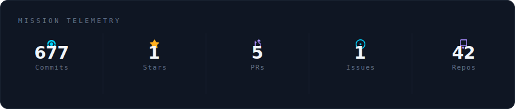

<div align="center">
  
</div>

<div align="center">


</div>

---

## 🧑‍💻 Sobre Mim
```java
@Component
public class Developer {

    @Value("Kauan Kelvin")
    private String nome;

    @Value("Desenvolvedor Back-End Junior")
    private String cargo;

    @Value("Goiás, Brasil 🇧🇷")
    private String localizacao;

    @Value("UniCesumar — Engenharia de Software, 5º Semestre")
    private String formacao;

    private List<String> foco = Arrays.asList(
        "APIs REST com Java & Spring Boot",
        "Automação de Processos com Python & Selenium",
        "Arquitetura de Microserviços",
        "Soluções reais para problemas reais de negócio"
    );

    private Map<String, String> diferenciais = Map.of(
        "freelancer", "Projetos entregues em produção para clientes reais",
        "mentalidade", "Engenheiro de Software, não apenas programador",
        "filosofia",  "Cada linha de código é uma chance de ser melhor."
    );
}
```

---

## 📊 Mission Telemetry

<div align="center">
  
</div>

---

## 🛠️ Stack Tecnológica

<div align="center">
  
</div>

<br/>

<div align="center">

**Back-End**


**Automação & RPA**


**Front-End**


**Banco de Dados**


**Ferramentas & DevOps**


</div>

---

## 🚀 Projetos em Destaque

<div align="center">

<table>
  <tr>
    <td width="50%" valign="top">
      <h3>🦷 <a href="https://github.com/kauankelvin7/Automacao-Clinica-Odontologica">Dental RPA — Automação Odontológica</a></h3>
      <p>
        <strong>Projeto freelancer real entregue em produção.</strong>
        Sistema RPA completo que automatiza 100% do faturamento de
        uma clínica odontológica junto às operadoras Porto Seguro e
        SulAmérica — do login ao upload de laudos e raios-X.
        Reduziu o tempo por guia de ~8 minutos para ~40 segundos,
        com zero erros de vinculação de documentos.
      </p>
      <p>
        
        
        
        
      </p>
    </td>
    <td width="50%" valign="top">
      <h3>🦴 <a href="https://github.com/kauankelvin7/Cinesia">Cinesia</a></h3>
      <p>
        Sistema web e PWA inteligente para potencializar os estudos
        de estudantes de Fisioterapia. Interface moderna com foco em
        performance e acessibilidade, construída com Spring Boot no
        back-end e TypeScript no front.
      </p>
      <p>
        
        
        
      </p>
    </td>
  </tr>
  <tr>
    <td width="50%" valign="top">
      <h3>📋 <a href="https://github.com/kauankelvin7/sistema-agenda-ocupacional">Sistema Agenda Ocupacional</a></h3>
      <p>
        Sistema robusto de gestão de agendamentos de exames médicos
        ocupacionais para clínicas de medicina do trabalho. Arquitetura
        orientada a segurança com Spring Security e persistência em
        PostgreSQL.
      </p>
      <p>
        
        
        
      </p>
    </td>
    <td width="50%" valign="top">
      <h3>♟️ <a href="https://github.com/kauankelvin7/Jogo-de-Xadrez">Jogo de Xadrez</a></h3>
      <p>
        Sistema completo de xadrez em Java com interface gráfica e
        implementação de todas as regras do jogo, incluindo jogadas
        especiais como en passant, roque e promoção de peão.
      </p>
      <p>
        
        
        
      </p>
    </td>
  </tr>
  <tr>
    <td width="50%" valign="top">
      <h3>💰 <a href="https://github.com/kauankelvin7/ControleDeGastos">Controle de Gastos</a></h3>
      <p>
        Aplicação web para gerenciamento financeiro pessoal com
        interface responsiva, relatórios visuais e controle de
        categorias de despesas.
      </p>
      <p>
        
        
        
      </p>
    </td>
    <td width="50%" valign="top">
      <h3>🌐 <a href="https://github.com/kauankelvin7/portifolio_dev">Portfólio Dev</a></h3>
      <p>
        Portfólio pessoal com cenas 3D interativas, animações
        Neo-Brutalistas e Adaptive Rendering — ajusta qualidade
        automaticamente conforme o hardware do visitante.
        Construído com Next.js, React Three Fiber e Framer Motion.
      </p>
      <p>
        
        
        
      </p>
    </td>
  </tr>
</table>

</div>

---

## 💼 Experiência Real

> Além dos projetos acadêmicos, já entreguei soluções em ambiente
> de produção para clientes reais como freelancer — o que me deu
> uma perspectiva prática sobre requisitos de negócio, prazos e
> qualidade de código que vai além da faculdade.

| Projeto | Cliente | Stack | Status |
|---|---|---|---|
| 🦷 Automação de Faturamento Odontológico | Clínica Odontológica (GO) | Python · Selenium · RPA | ✅ Em produção |

---

## 🌱 Estudando Agora

<div align="center">

| 🛸 Tecnologia | 📡 Foco Atual |
|---|---|
| ☕ Spring Framework | Boot · Security · Data JPA · Microserviços |
| 🧪 Testes | JUnit · Mockito · Testes de integração |
| ☁️ Cloud & DevOps | AWS · Docker · CI/CD com GitHub Actions |
| 📐 Arquitetura | Design Patterns · DDD · Clean Architecture |
| 📚 Formação | Engenharia de Software — UniCesumar (5º sem.) |

</div>

---

## 📫 Contato

<div align="center">

[](https://www.linkedin.com/in/kauan-kelvin-9069602a5/)
[](mailto:kelvinkauan722@gmail.com)
[](https://kauankelvindev.vercel.app/)

<br/>


<br/>


</div>
