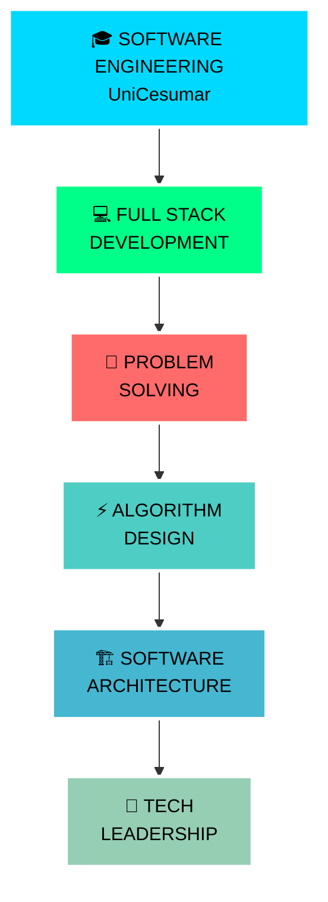

#  **Kauan Kelvin**

<div align="center">
  
</div>

<div align="center">
  


</div>

<div align="center">
  
</div>

---

##  **ABOUT ME**

<div align="center">

```typescript
interface Developer {
  name: string;
  role: string;
  location: string;
  education: string;
  passion: string[];
  currentFocus: string;
}

const kauan: Developer = {
  name: "Kauan Kelvin",
  role: "Full Stack Developer & Software Engineering Student",
  location: "Brasília, Brazil 🇧🇷",
  education: "Software Engineering @ UniCesumar",
  passion: [
    "Building scalable applications",
    "Clean code architecture", 
    "User experience design",
    "Continuous learning"
  ],
  currentFocus: "Transforming ideas into digital reality ✨"
};

// Life motto
console.log("Code with purpose, build with passion! 🚀");
```

</div>

<div align="center">
  
</div>

---

##  **TECH STACK**

<div align="center">

###  **CORE LANGUAGES**

<p align="center">
  
</p>


---

###  **FRONTEND ARSENAL**

<p align="center">
  
</p>


---

###  **BACKEND POWER**

<p align="center">
  
</p>


---

###  **DATABASE & CLOUD**

<p align="center">
  
</p>


---

###  **DEVELOPMENT TOOLS**

<p align="center">
  
</p>


</div>

<div align="center">
  
</div>

---

##  **GITHUB ANALYTICS**

<div align="center">

<table>
<tr>
<td width="50%">


</td>
<td width="50%">


</td>
</tr>
</table>


</div>

<div align="center">
  
</div>

---

##  **FEATURED PROJECTS**

<div align="center">

<table>
<tr>
<td width="50%" valign="top">

###  **CHESS MASTER**

[](https://github.com/kauankelvin7/Jogo-de-Xadrez)

**🎯 DESCRIÇÃO**  
Sistema completo de xadrez desenvolvido em Java com interface gráfica intuitiva e lógica robusta. Implementa todas as regras do xadrez clássico com validação de movimentos inteligente.

**🚀 CARACTERÍSTICAS**
- ✅ Interface gráfica moderna
- ✅ Validação completa de movimentos
- ✅ Sistema de turnos
- ✅ Detecção de xeque-mate

**🛠️ TECH STACK**  


</td>
<td width="50%" valign="top">

###  **EXPENSE TRACKER**

[](https://github.com/kauankelvin7/ControleDeGastos)

**🎯 DESCRIÇÃO**  
Aplicação web para gerenciamento financeiro pessoal com categorização de despesas, relatórios visuais e análise de padrões de gastos. Interface responsiva e intuitiva.

**🚀 CARACTERÍSTICAS**
- ✅ Controle de receitas/despesas  
- ✅ Categorização automática
- ✅ Relatórios visuais
- ✅ Interface responsiva

**🛠️ TECH STACK**  


</td>
</tr>
</table>

</div>

<div align="center">
  
</div>

---

##  **EDUCATION & GROWTH**

<div align="center">


```mermaid
graph TB
    A["🎓 SOFTWARE ENGINEERING<br/>UniCesumar"] --> B["💻 FULL STACK<br/>DEVELOPMENT"]
    B --> C["🧠 PROBLEM<br/>SOLVING"]
    C --> D["⚡ ALGORITHM<br/>DESIGN"]
    D --> E["🏗️ SOFTWARE<br/>ARCHITECTURE"]
    E --> F["🚀 TECH<br/>LEADERSHIP"]
    
    style A fill:#00D9FF,stroke:#FFFFFF,stroke-width:3px,color:#000000
    style B fill:#00FF88,stroke:#FFFFFF,stroke-width:3px,color:#000000
    style C fill:#FF6B6B,stroke:#FFFFFF,stroke-width:3px,color:#000000
    style D fill:#4ECDC4,stroke:#FFFFFF,stroke-width:3px,color:#000000
    style E fill:#45B7D1,stroke:#FFFFFF,stroke-width:3px,color:#000000
    style F fill:#96CEB4,stroke:#FFFFFF,stroke-width:3px,color:#000000
```

### 🎯 **ACADEMIC FOCUS**
**Building tomorrow's digital solutions through comprehensive software engineering education**

### 📚 **CORE COMPETENCIES**
- **Algorithm Design & Data Structures** - Optimized solutions for complex problems
- **Software Architecture** - Scalable and maintainable system design  
- **Database Systems** - Efficient data modeling and management
- **Web Development** - Modern frontend and backend technologies
- **Project Management** - Agile methodologies and team collaboration

</div>

---

##  **CONNECT & COLLABORATE**

<div align="center">

### 🌐 **LET'S BUILD SOMETHING AMAZING TOGETHER!**

<p align="center">
  <a href="https://www.linkedin.com/in/kauan-kelvin-9069602a5/" target="_blank">
    
  </a>
  <a href="mailto:kelvinkauan722@gmail.com">
    
  </a>
  <a href="https://github.com/kauankelvin7" target="_blank">
    
  </a>
  <a href="#" target="_blank">
    
  </a>
</p>

</div>

<div align="center">
  
</div>

---

##  **CODING METRICS**

<div align="center">


###  **GITHUB ACHIEVEMENTS**


</div>

---

<div align="center">

### *"In a world of endless possibilities, I craft digital experiences that matter"* ✨

 **Ready to innovate together?**

---

###  **FUN FACTS ABOUT ME**

<table align="center">
<tr>
<td align="center">🌙</td>
<td><strong>Night Owl Developer</strong><br/>Peak creativity hits after midnight</td>
</tr>
<tr>
<td align="center">☕</td>
<td><strong>Coffee-Driven Code</strong><br/>My debugging fuel of choice</td>
</tr>
<tr>
<td align="center">🎮</td>
<td><strong>Gamer Heart</strong><br/>Strategy games inspire my coding logic</td>
</tr>
<tr>
<td align="center">🌱</td>
<td><strong>Lifelong Learner</strong><br/>Always exploring new technologies</td>
</tr>
<tr>
<td align="center">🎨</td>
<td><strong>Code Artist</strong><br/>Beautiful code is my masterpiece</td>
</tr>
</table>

</div>

<div align="center">
  
</div>

---

<div align="center">
  
</div>
